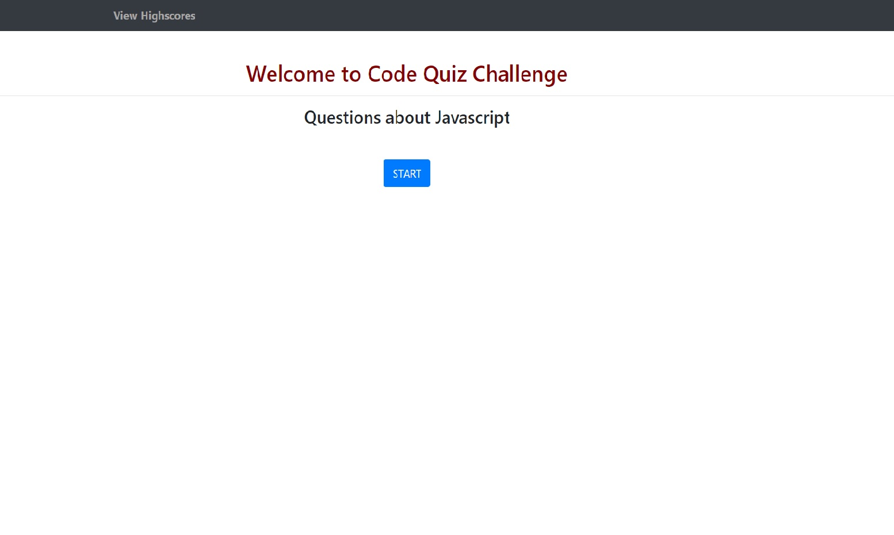
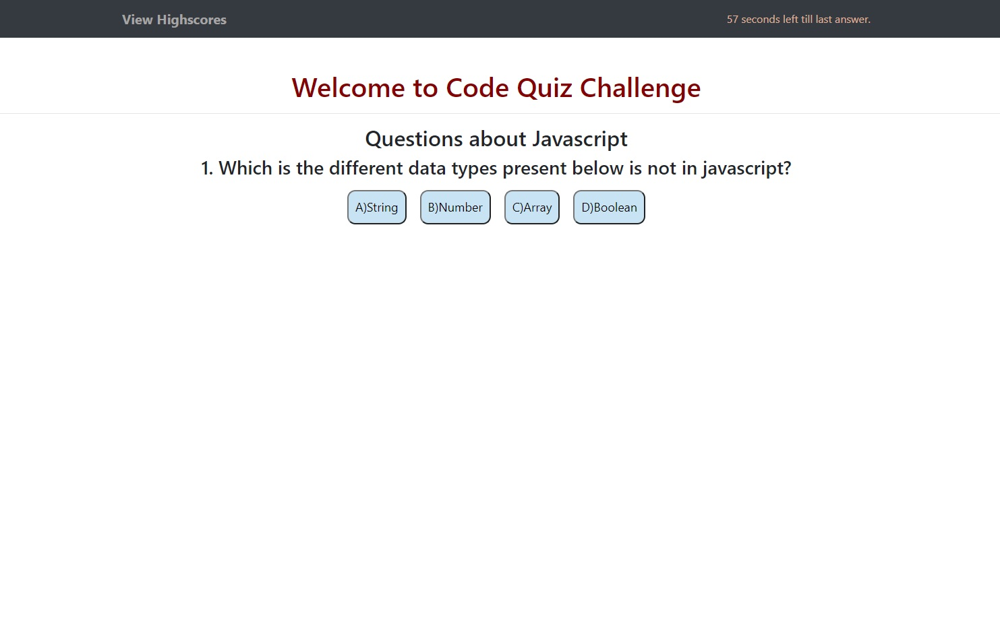
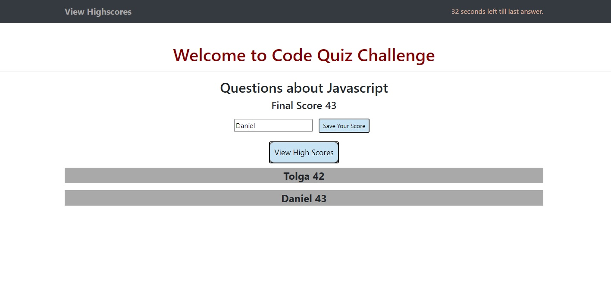

## Code-Quiz
# Web-APIs

## Libraries
1. Bootstrap
2. Javascript

## About
- The purpose of this page to play quick quiz game with given questions. And to get highest point.

## What I learned
- Functions
- Using an arrays in loops
- Using if/else statements
- querySelector
- setItem
- getItem
- localstorage
- timer
- preventdefault
- JSON(parse)
- window
- setattribute

## ScreenShots

# Password generator Screenshots
- 
- 
- 

## Link
1. [github.io](https://tolgas92.github.io/Web-APIs-Code-Quiz/)
2. [github](https://github.com/TolgaS92/Web-APIs-Code-Quiz)